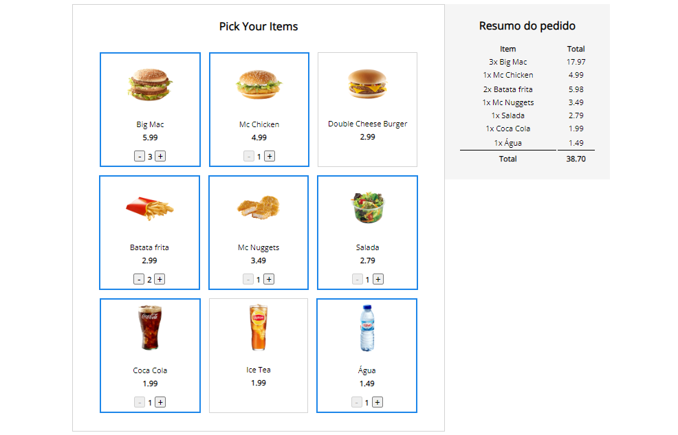

<h1 align="center">Self Service Machine</h1>

  

## 🚀 Tecnologias

Esse projeto foi desenvolvido com as seguintes tecnologias:

- HTML e CSS
- JavaScript
- ViuJS

## 💻 Projeto

Um simples projeto de um app web de um serviço self service para pedidos de estabelecimentos de lanchonete.
Ao selecionar o item desejado e quantidade é colocado os item no resumo do pedido e calculado seu sub total por item e total geral do pedido.

- [Acesse o projeto finalizado, online](https://github.com/cleber-risu/my-link-aggregator)

---

Feito com ♥ by Cleber-Risu
